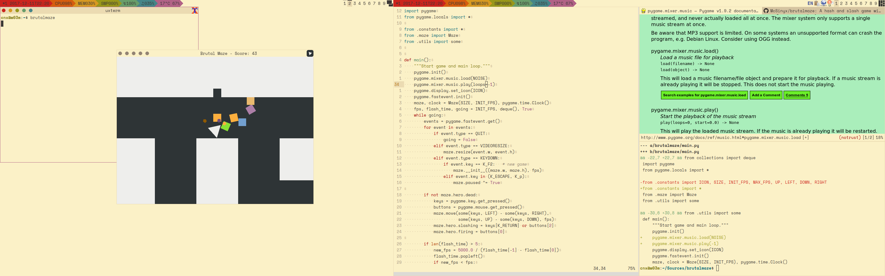
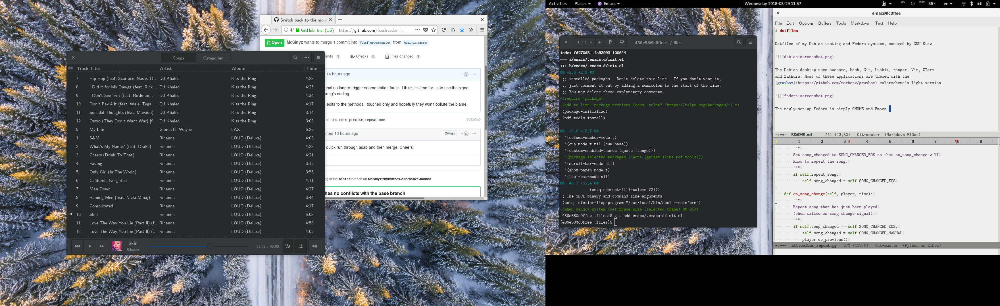
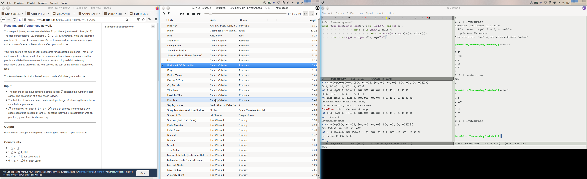

# dotfiles

Dotfiles of my Debian testing, Fedora workstation and NixOS unstable,
managed by GNU Stow.

The Debian desktop uses awesome, bash, Git, Firefox, ranger, Vim, URxvt
and Zathura. Most of these applications are themed with the
[srcery](https://github.com/srcery-colors/srcery-vim) colorscheme.

The Fedora desktop is vanilla GNOME with Emacs. Yes you can run four systems
in parallel: GNU/Linux, systemd, GNOME JS VM and Emacs.

The NixOS uses KDE Plasma with Emacs and Alacritty.  Nothing really special
other than the Nix itself.
