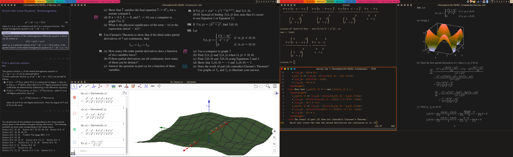

# dotfiles

Dotfiles of my Debian testing, managed by GNU Stow.

The Debian desktop uses awesome, bash, Git, Luakit, ranger, Vim, XTerm
and Zathura. Most of these applications are themed with the
[srcery](https://github.com/srcery-colors/srcery-vim) colorscheme.
